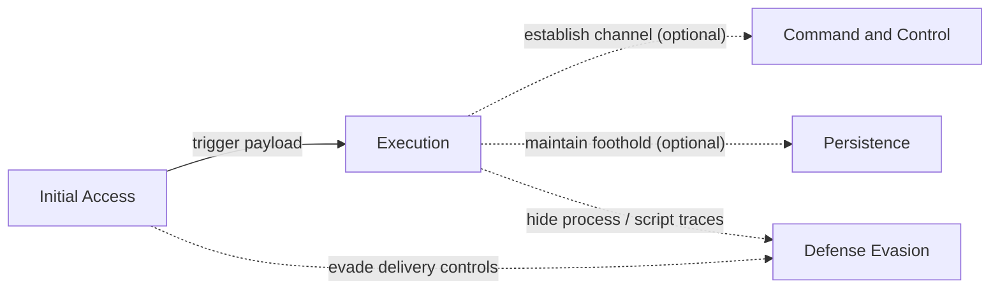
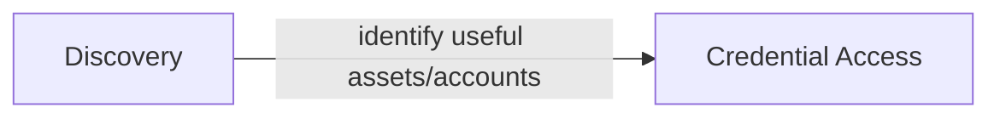
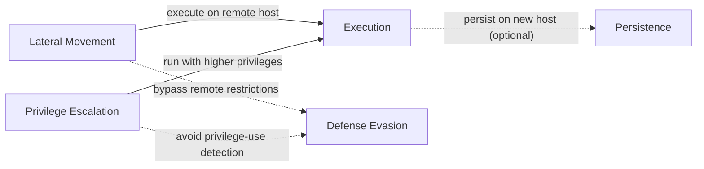
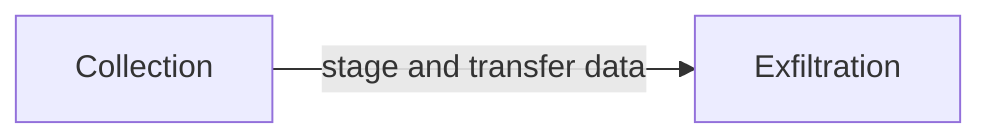
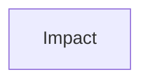

# Templates
Do kịch bản cụ thể chưa được MITRE ATTT&CK Evaluation công bố cụ thể nên để dễ dàng xây dựng kịch bản tôi đưa ra một số templates phổ biến trong các kịch bản tấn công đã gặp để từ đó dự đoán một số case liên quan từ danh sách kĩ thuật đã công bố.
## Phase 1

## Phase 2

Phase 2 output: discovered hosts, services, trust paths, and credentials become operational input for later expansion.
## Phase 3
Phase 3 input: use Phase 2 findings to choose lateral paths, target privileged accounts, and execute on remote systems.

## Phase 4

## Phase 5

